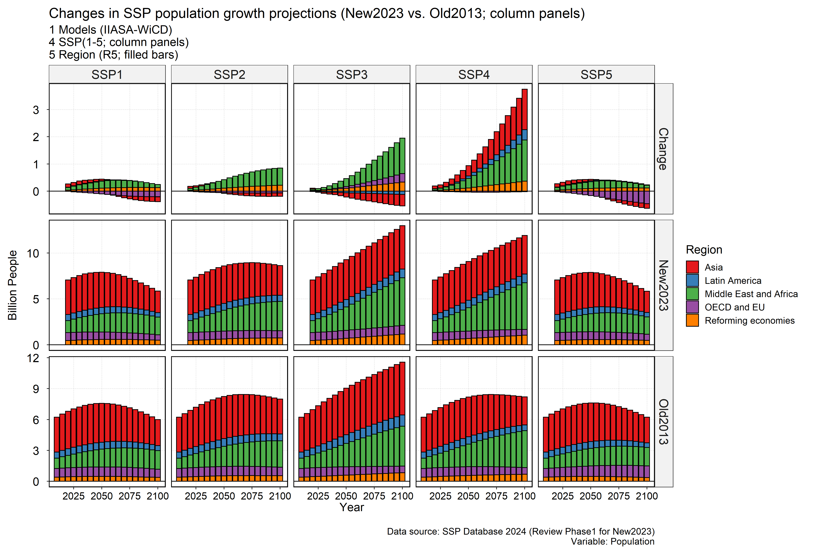
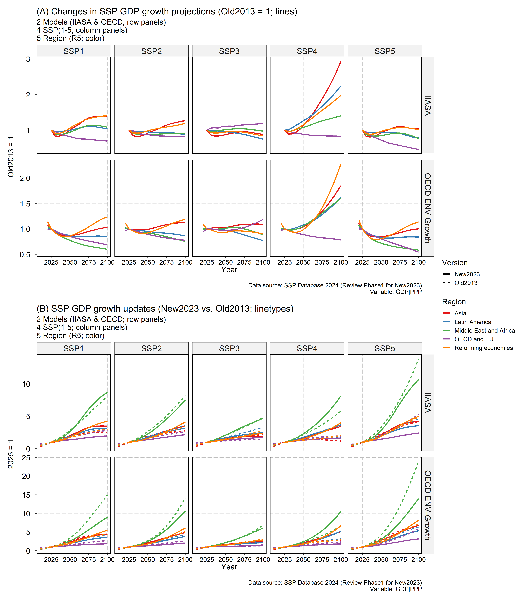

**Two quick figures summarizing recent SSP database updates.** The new SSP projections show mostly higher population growth, E.g., globally +10% in SSP2 & +46% in SSP4 by 2100, but largely driven by African changes. GDP growth between the two models remains quite different, but relatively lower near-term growth is seen in most places. Most likely, climate goals will be more difficult to achieve in IAMs.

